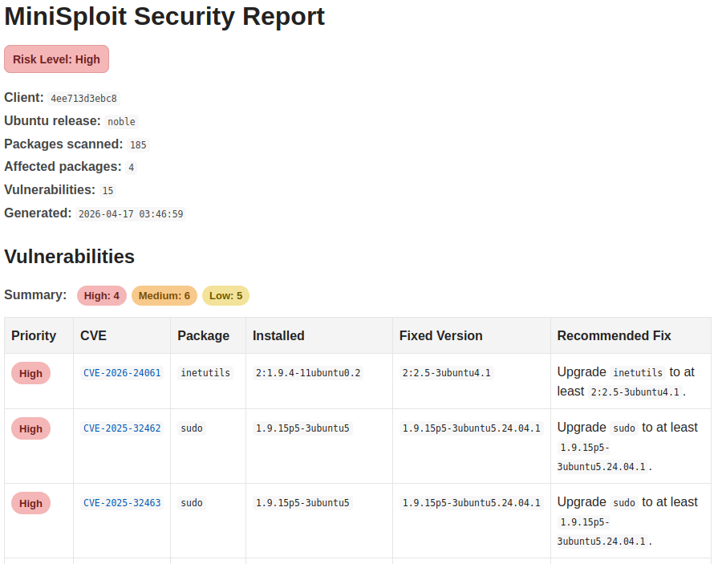
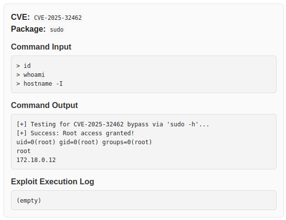

# MiniSploit

MiniSploit is a client-server vulnerability analysis tool that scans Ubuntu systems, maps installed packages to known CVEs using the Ubuntu Security Tracker, and optionally validates findings using real-world PoC exploits in a controlled lab environment.

---

## 🧠 Overview

MiniSploit simulates a real-world vulnerability scanning workflow:

1. A client gathers system and package information  
2. The data is sent to a server via a REST API  
3. The server compares the data against a locally built CVE database  
4. Matching vulnerabilities are returned  
5. Optional PoC exploits can be executed (with user permission)  
6. A final security report is generated

---

## ⚠️ Security Notice
For educational and authorized testing environments only.
Do not use on systems you do not own or have permission to assess.
This project includes intentionally vulnerable Docker environments for educational testing.
These configurations are insecure by design and must only be used in isolated local environments.

---

## 💡 Why MiniSploit

This project was built to explore how vulnerability scanners work under the hood, including:
- Mapping package versions to CVEs
- Handling real-world vulnerability data sources
- Validating findings using controlled exploit execution
- Designing a simple client-server scanning pipeline

---

## 🔍 Key Features

- Package inventory collection from target systems  
- CVE matching using real Ubuntu vulnerability data  
- Client-server architecture using HTTP (POST requests)  
- Optional proof-of-concept exploit validation  
- Automated security report generation  
- Multi-version Ubuntu test environment using Docker

---

## 🎥 Demo Video

Click below to watch MiniSploit in action.

[](https://youtu.be/v5HaaeH-4Xg)

---

## 🖥️ Environment

This project was developed and tested on a Linux virtual machine.

- OS: Ubuntu (recommended)
- Network: Local VM network (client and server communication)

The project can be run on any Linux system with Docker and Python installed.

---

## 🧱 Architecture

### Components

- **Server (`server/`)**
  - FastAPI-based backend
  - Accepts POST requests from clients
  - Processes package data
  - Matches against CVE database
  - Returns results

- **Configuration (`settings.py`)**
  - Defines key variables such as:
    - Data sources
    - Paths
    - Server configuration

- **Docker Environment (`docker/`)**
  - Creates intentionally vulnerable Ubuntu systems:
    - 20.04 (Focal)
    - 22.04 (Jammy)
    - 24.04 (Noble)
  - Used to test the full pipeline
 
- **Client (`client/`)**
  - Collects installed packages and OS information
  - Sends data to the server
  - Receives vulnerability matches
  - Optionally runs PoC exploits
  - Generates a report
  - **PoC (`client/poc`)**
    - Small PoC exploit library

---

## 📦 Data Source

This project uses the Ubuntu CVE Tracker as its vulnerability data source.

On server startup:

1. The CVE Tracker repository is cloned or updated  
2. Vulnerability data is parsed  
3. A local database is built for fast lookup  

---

## 🗄️ Local Database

- Stored in a `~/minisploit/data/` directory (generated at runtime)
- Created in the user's home folder and separate from the repository
- Automatically created when the server starts

> The first run may take additional time while the database is built.
> The server also checks for updates on startup and rebuilds the database if new data is available.

---

## 🐳 Docker Setup

MiniSploit uses a single parameterized Dockerfile to build multiple intentionally vulnerable Ubuntu environments.

The `docker-compose.yml` file defines three services:
- Focal (20.04)
- Jammy (22.04)
- Noble (24.04)

Each service builds from the same Dockerfile using different base images.

---

## ⚙️ Requirements

- Docker & Docker Compose  
- Python 3.x  
- pip  

---

## 🚀 Usage

### 1. Installation

Clone the repository:

git clone https://github.com/mickaela-codes/MiniSploit.git

cd MiniSploit

Install dependencies:

pip install -r requirements.txt

### 2. Start the server

```bash
cd minisploit
python3 -m server
```
Server will run at:
```
http://127.0.0.1:8000
```

### 3. Start Docker test environments

```bash
cd docker
docker-compose up -d --build
```

### 4. Enter a container

```
docker exec -it -u ubuntu focal bash
docker exec -it -u ubuntu jammy bash
docker exec -it -u ubuntu noble bash
```
Run client on same machine as server:
```
cd client
python3 send_inventory.py
```
Connects to:
```
http://127.0.0.1:8000
```
or input the IP address of machine you're running the server on:
```
cd client
python3 send_inventory.py xxx.xxx.xx.xxx
```
View generated reports in client/reports

### 5. Shutdown Docker containers

```
docker-compose down
```
## 📸 Example Report

The following is a sample report generated after scanning the Jammy container:



---

## 🧪 Proof-of-Concept Exploits
MiniSploit includes a small library of publicly available PoC exploits.
- The user is prompted before any exploit is executed
- Exploits are used only to validate detected vulnerabilities
- Intended for controlled, educational environments only
- PoCs are sourced from publicly disclosed research and retain attribution to original authors


---

## 🧩 Known Limitations
- CVE matching is dependent on parsing accuracy
- No authentication between client and server
- Some configuration values are hardcoded for testing
- Network dependency for initial CVE data retrieval

---

## 🔮 Future Improvements
- Add authentication and secure communication
- Improve CVE matching accuracy
- Expand PoC exploit coverage
- Expand to more operating systems
